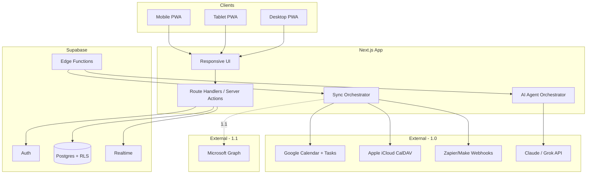
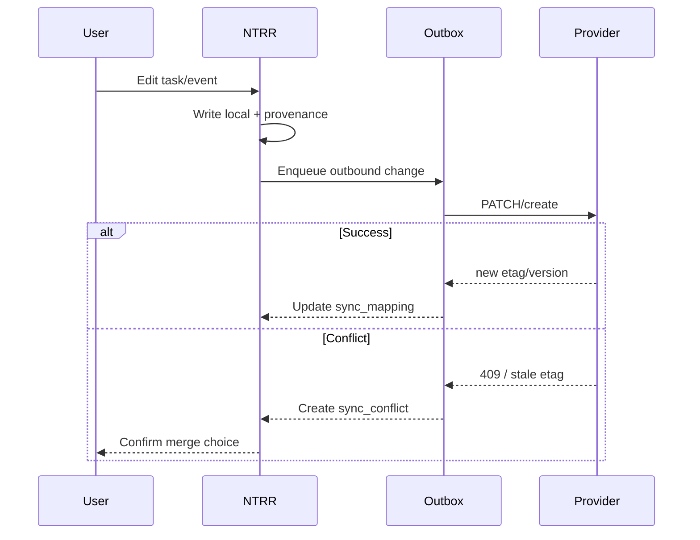

# NTRR 1.0 Release Plan

**Status:** Approved  
**Target:** Responsive PWA coordination hub for mobile, tablet, and desktop  
**Estimate:** ~16 weeks (solo bootstrap)

Related docs: [README.md](../README.md) · [AGENTS.md](../AGENTS.md)

---

## Release definition

**NTRR 1.0** = Phase 1 coordination hub — the MVP described in README and AGENTS.md.

| Requirement | 1.0 acceptance |
|-------------|----------------|
| Cross-ecosystem sync | **Google** (Calendar + Tasks) bidirectional; **Apple** via CalDAV calendar + Zapier/Make reminder ingest |
| Family task board | Shared tasks, roles/permissions, recurring templates |
| Unified dashboard | Today's priorities, family status, AI highlights |
| AI agents | Reminders, schedule conflicts, actionable suggestions |
| Family invites | Email invite → role assignment → household join |
| PWA | Installable, responsive, touch-friendly, offline shell |
| Data reliability | Provenance on every synced/native record; conflict UI |
| Security | Supabase auth, RLS, encryption, audit logs |

### Deferred to 1.1

| Item | Notes |
|------|-------|
| **Microsoft Graph sync** | Outlook Calendar + Microsoft To Do bidirectional |
| Microsoft OAuth login | Optional; not required for 1.0 sign-in |

### Out of scope for 1.0

- HIPAA/clinical data
- Document vault, finance, legacy modules
- Native iOS/Android apps
- Full Apple Reminders API (does not exist)
- Apple Reminders write-back

---

## Architecture



### Stack

| Layer | Choice |
|-------|--------|
| Frontend | Next.js 15 App Router, TypeScript, Tailwind, shadcn/ui |
| Backend | Supabase (Postgres, Auth, RLS, Realtime, Edge Functions) |
| Sync jobs | Edge Functions + Vercel Cron |
| AI | Server-side Grok/Claude |
| Hosting | Vercel (app) + Supabase (data) |

### Planned repo layout

```
ntrr/
├── app/                    # Next.js routes
├── components/             # Breakpoint-aware UI
├── lib/
│   ├── supabase/
│   ├── sync/               # google/, apple-caldav/, microsoft/ (stub)
│   ├── provenance/
│   ├── ai/
│   └── permissions/
├── supabase/
│   ├── migrations/
│   └── functions/
├── public/                 # manifest, icons, service worker
├── docs/
│   └── RELEASE-1.0.md      # this file
├── AGENTS.md
└── README.md
```

### Provider-agnostic sync module

Build `lib/sync/` with a shared interface from day one so 1.1 Microsoft is additive:

```
lib/sync/
├── types.ts           # SyncProvider, SyncEntity, Provenance, OutboxEntry
├── orchestrator.ts    # routes pull/push per provider
├── conflict.ts        # detect, store, resolve
├── google/            # 1.0
├── apple-caldav/      # 1.0
└── microsoft/         # stub in 1.0; full impl in 1.1
```

---

## Responsive / PWA strategy

Design **mobile-first**; enhance at `sm` (640px) and `lg` (1024px).

| Breakpoint | Layout | Navigation |
|------------|--------|------------|
| Mobile (<640px) | Single column; stacked cards; bottom tab bar | Home · Tasks · Family · Settings |
| Tablet (640–1024px) | Two-column dashboard; collapsible side panel | Side rail + content |
| Desktop (>1024px) | Sidebar · main · detail pane | Persistent sidebar |

### PWA requirements

- Web app manifest (name, icons 192/512, `display: standalone`)
- Service worker: app shell cache + stale-while-revalidate for static assets
- Safe-area insets for notched phones
- Touch targets ≥ 44px; no hover-only interactions
- WCAG 2.1 AA contrast on core flows
- Install prompt after first successful login

### Per-screen behavior

| Screen | Mobile | Tablet | Desktop |
|--------|--------|--------|---------|
| Dashboard | Vertical feed | 2-up grid | 3-column: priorities · status · AI |
| Task board | List/kanban toggle | Kanban | Full kanban + drag-drop |
| Conflicts | Condensed list | List + preview | Timeline + provenance chips |
| Integrations | Full-page steps | Full-page | Settings panel + live status |

---

## Data model

Every user-visible entity carries provenance:

```typescript
type Provenance = {
  source: 'ntrr' | 'google' | 'microsoft' | 'apple_caldav' | 'zapier';
  externalId?: string;
  syncedAt: string;
  confidence: 'high' | 'medium' | 'low';
  lastModifiedBy: 'user' | 'sync' | 'ai';
};
```

### Core tables

- `households`, `household_members` (roles: `owner` | `admin` | `caregiver` | `viewer`)
- `integration_accounts` (encrypted OAuth tokens, provider, scopes, status)
- `calendar_events`, `tasks` (native + mirrored; `provenance` JSONB)
- `sync_mappings` (NTRR id ↔ external id, etag/version)
- `sync_conflicts` (field-level diff; `pending` | `resolved`)
- `recurring_task_templates`
- `ai_insights` (type, payload, dismissed_at)
- `audit_log` (actor, action, entity, metadata)
- `invites` (token, role, expires_at)

**RLS:** users only access rows for households they belong to; role gates writes on integrations and member management.

---

## Sync design

### Conflict flow



### Google (1.0 — bidirectional)

- OAuth 2.0: Calendar API + Tasks API
- Inbound: incremental sync via `syncToken`
- Outbound: write queue with etag checks
- Push: Calendar watch channels → Edge Function webhook

### Apple (1.0 — workaround)

- **Calendar:** CalDAV (iCloud app-specific password); bidirectional where etag supported
- **Reminders:** Zapier/Make one-way ingest → `tasks` with `source: zapier`
- Settings UI labels limitations clearly

### Conflict policy

- Never silently overwrite
- Dashboard surfaces pending conflict count
- User picks: keep local, keep remote, or merge field-by-field
- All resolutions logged to `audit_log`

---

## AI agents (1.0)

| Agent | Trigger | Output |
|-------|---------|--------|
| Conflict detector | After each sync cycle | `ai_insights` + dashboard badge |
| Reminder suggester | Daily cron per household | Unassigned/overdue items |
| Schedule insight | Daily digest | Overlapping events, missing handoffs |

- Single `lib/ai/orchestrator.ts` with structured JSON schema
- Suggestions only — no autonomous writes
- User can dismiss/snooze

---

## Milestones

| Milestone | Weeks | Deliverable | Exit criteria |
|-----------|-------|-------------|---------------|
| **M0** Foundation | 1–2 | Next.js + Supabase + PWA shell + auth | Sign up, create household, empty dashboard on phone + desktop |
| **M1** Family | 3–4 | Invites, roles, member management | Two users join with different roles on all devices |
| **M2** Tasks | 5–7 | Native task board + recurring templates | Family coordinates without external sync |
| **M3** Google sync | 8–10 | Bidirectional Google Calendar + Tasks | Conflicts require user confirmation; sync layer provider-agnostic |
| **M4** Apple + dashboard | 11–12 | CalDAV + Zapier + unified dashboard | Day view: NTRR tasks + Google + Apple events |
| **M5** AI | 13–14 | Daily digest + insights | Actionable insights without manual refresh |
| **M6** Launch | 15–16 | Security, E2E, beta, deploy | 1.0 tagged on ntrrr.com; acceptance matrix green |

### M0 checklist

- [x] Scaffold Next.js 15 + TypeScript + Tailwind + shadcn/ui
- [x] Supabase project + local dev config
- [x] Auth: email magic link + Google OAuth (login)
- [x] Migration: `households`, `household_members`, `audit_log`, `integration_accounts`
- [x] RLS policies
- [x] Responsive app shell (bottom nav / sidebar)
- [x] PWA manifest + service worker shell
- [x] Empty dashboard route

### M1 checklist

- [x] Invite creation (email, role, expiry)
- [x] Invite acceptance flow
- [x] Role-based UI gating
- [x] Family status panel on dashboard
- [x] Member management screen (all breakpoints)

### M2 checklist

- [x] Task CRUD (title, assignee, due date, status)
- [x] Recurring task templates
- [x] Kanban + list views
- [x] Mobile swipe actions
- [x] Supabase Realtime subscriptions
- [x] Provenance on native tasks

### M3 checklist

- [x] Google OAuth connect in Settings
- [x] Calendar inbound/outbound sync
- [x] Tasks inbound/outbound sync
- [x] Outbox with retry
- [x] Etag conflict detection
- [x] Conflict resolution UI
- [x] `lib/sync/microsoft/` stub for 1.1

### M4 checklist

- [ ] CalDAV connect wizard
- [ ] Zapier/Make webhook endpoint
- [ ] Dashboard: today's priorities
- [ ] Dashboard: family status
- [ ] Dashboard: AI highlights slot
- [ ] Unified day/agenda view

### M5 checklist

- [ ] Daily digest Edge Function
- [ ] Conflict detector agent
- [ ] Reminder suggester agent
- [ ] Schedule overlap agent
- [ ] Dismiss/snooze UX
- [ ] Loading/error states on AI panels

### M6 checklist

- [ ] RLS security audit
- [ ] Token encryption review
- [ ] Rate limits on webhooks/API
- [ ] Playwright E2E (mobile + desktop viewports)
- [ ] Performance: LCP < 2.5s on 4G
- [ ] Accessibility pass (keyboard, screen reader, focus)
- [ ] Beta with 3–5 caregiver households
- [ ] Privacy policy + onboarding copy
- [ ] Deploy to ntrr.com
- [ ] Tag v1.0.0

---

## Acceptance test matrix

| Flow | Mobile | Tablet | Desktop |
|------|--------|--------|---------|
| Sign up / login | required | required | required |
| Accept invite | required | required | required |
| View dashboard | required | required | required |
| Create/assign task | required | required | required |
| Connect Google | required | required | required |
| Connect Apple CalDAV | required | required | required |
| Resolve sync conflict | required | required | required |
| PWA install | required | optional | optional |
| Recurring template | required | required | required |
| AI insight dismiss | required | required | required |
| Connect Microsoft | 1.1 | 1.1 | 1.1 |

---

## 1.1 preview (Microsoft)

Planned fast-follow ~3–4 weeks after 1.0 stabilizes:

- Microsoft Graph OAuth (`Calendars.ReadWrite`, `Tasks.ReadWrite`)
- Delta query inbound + etag outbound (same conflict pipeline)
- Graph change subscriptions + webhook renewal
- Settings "Connect Microsoft" card
- Dashboard unified view includes Outlook events/tasks
- Implement `lib/sync/microsoft/` — no schema changes

---

## Risks and mitigations

| Risk | Mitigation |
|------|------------|
| Apple Reminders has no API | Zapier one-way ingest; clear UX labeling |
| Google-only leaves out Microsoft households | Communicate 1.1 timeline; architecture ready |
| Bidirectional sync bugs | Conflict UI + audit log; extensive etag tests |
| Solo builder bandwidth | Microsoft deferral saves ~2 weeks on 1.0 |
| OAuth token expiry | Refresh job + "reconnect" banner on integration cards |
| AI cost | Daily batch per household; cache insights 24h |

---

## Success metrics

- Median time-to-first-invite < 5 minutes
- ≥ 1 external provider connected per active household
- Conflict resolution within 2 taps/clicks on mobile
- Dashboard usable in < 3s on mid-tier phone
- Zero silent merge incidents in beta (audit log sampling)

---

## Next step

**M0:** Scaffold Next.js + Supabase in repo root, responsive app shell + auth + empty dashboard, initial Supabase migration.